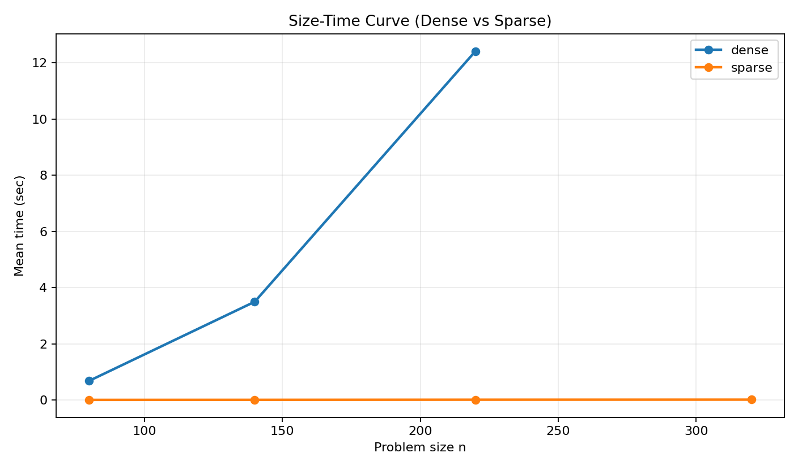
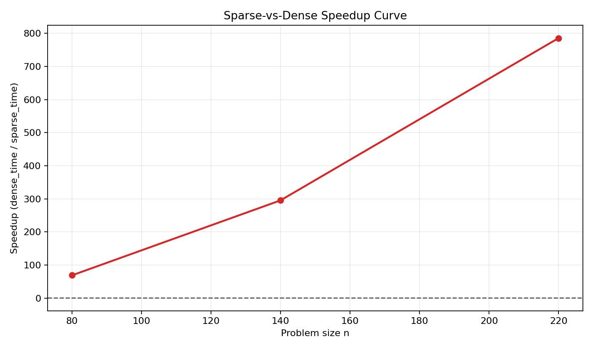
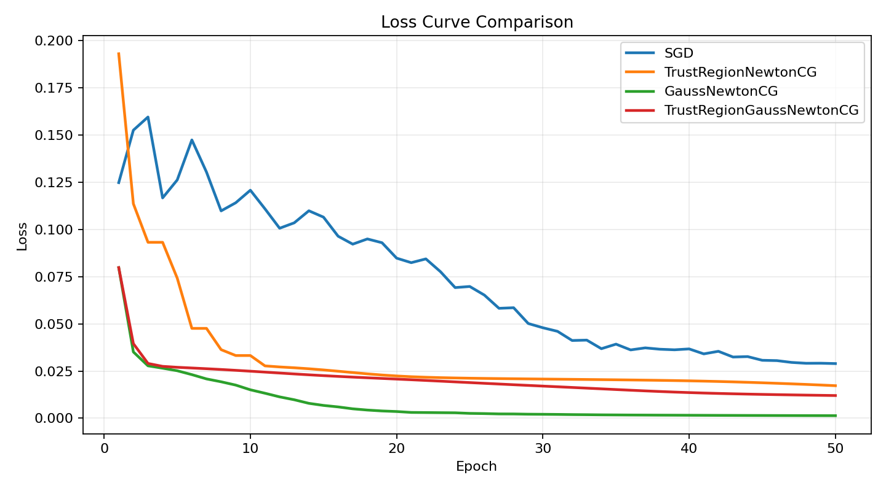
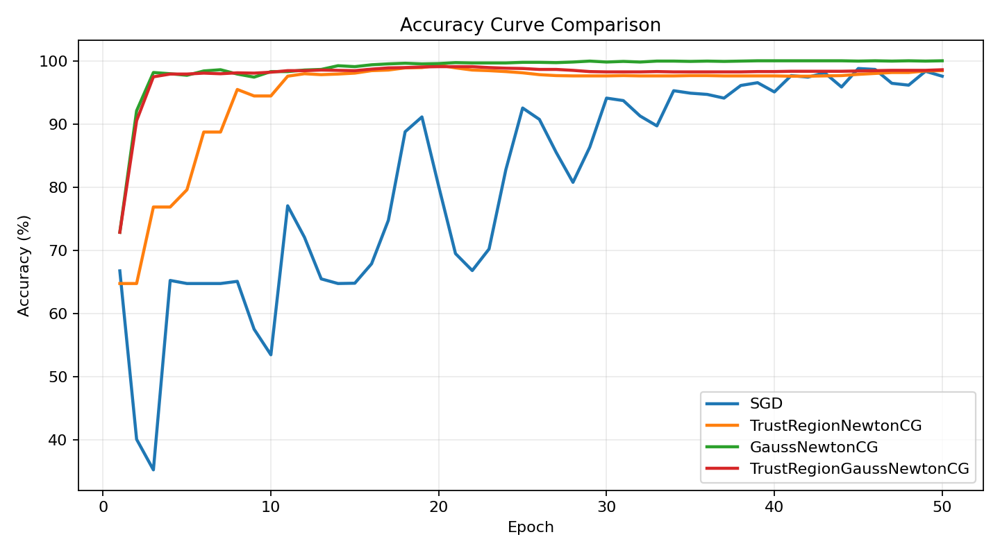
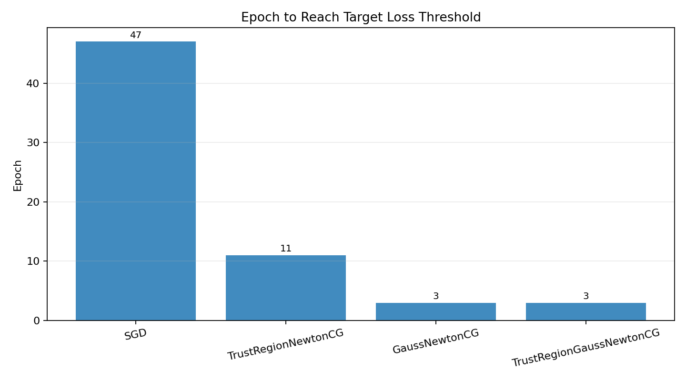

# 优化算法实战仓库

## 作者

- 作者：YU Wentao
- Supervised by: XU Mingyue

---

## 这个仓库包含四部分

1. **C++ 版数值优化**
2. **PyTorch 版二阶优化器实验**
3. **微型凸优化求解器（原对偶内点法）**
4. **Lean 4 形式化优化理论**

---

## C++ 部分

核心模块：

- 自动微分（AutoDiff）
  - 前向模式（Forward Mode）
  - 反向模式（Reverse Mode）
- 线搜索（Line Search）
  - 满足 Strong Wolfe conditions 的步长选择（含 zoom）
- 拟牛顿法（Quasi-Newton）
  - 梯度下降（Gradient Descent）
  - BFGS
  - L-BFGS（低内存）

相关文件：

- `main.cpp`：完整实现与 demo（Rosenbrock 函数）
- `CMakeLists.txt`：CMake 构建脚本

运行示例：

```bash
cmake -S . -B build
cmake --build build
./build/autodiff_optimization
```

---

## 微型凸优化求解器

目标问题（标准形式 LP/QP）：

- `min 0.5 * x^T Q x + c^T x`
- `s.t. A x = b`
- `x >= 0`

已实现能力：

- 原对偶内点法（Primal-Dual Interior Point Method）
- 基于 KKT 条件的牛顿迭代（Mehrotra predictor-corrector）
- 手写稠密 Cholesky 分解与三角回代（用于 SPD 系统）
- Schur 补降维求解（先解 `dy` 再回代 `dx, dz`）
- 稀疏矩阵入口：`scipy.sparse` + `splu`（解 `H`）+ `CG`（解 Schur 补）

相关文件：

- `mini_convex_solver.py`：求解器主实现（`solve_lp` / `solve_qp` / `solve_lp_sparse` / `solve_qp_sparse`）
- `demo_convex_solver.py`：LP/QP 与稀疏 QP 示例
- `benchmark_convex_solver.py`：dense vs sparse 性能基准脚本

运行 demo：

```bash
python3 demo_convex_solver.py
```

稀疏入口示例（大规模线性系统建议）：

```python
from mini_convex_solver import SolverOptions, solve_qp_sparse

result = solve_qp_sparse(
    Q_sparse,
    c,
    A_sparse,
    b,
    options=SolverOptions(max_iters=80, tol=1e-8),
    h_solver="splu",      # "splu" 或 "cg"
    schur_solver="cg",    # "cg" 或 "dense"
    cg_tol=1e-9,
    cg_max_iters=800,
)
```

运行性能基准（dense vs sparse）：

```bash
python3 benchmark_convex_solver.py --sizes 80,140,220,320 --trials 3 --density 0.02
```

> 脚本默认自动生成曲线图；若环境暂时没有 `matplotlib`，可先加 `--skip-plots` 仅导出数值报告。

默认输出到 `benchmarks/`：

- `solver_benchmark_summary.csv`
- `solver_benchmark_summary.json`
- `solver_benchmark_raw.json`
- `solver_benchmark_size_time.png`
- `solver_benchmark_speedup.png`

### 基准曲线图





---

## Lean 4 形式化优化理论

核心任务（形式化语言）：

- 定义凸函数：`ConvexFun`
- 定义强凸：`StronglyConvexWithGrad`
- 定义 Lipschitz 连续梯度：`LipschitzGradient`
- 定义固定步长梯度下降递推：`gdStep` / `gdIter`

机器证明（Lean）：

- `linearConvergence_fromContraction`
  - 证明：若单步满足收缩不等式，则固定步长梯度下降具有线性收敛率
- `gradientDescent_linearRate`
  - 以“强凸 + Lipschitz 梯度推导出的单步收缩引理”为前提，得到标准线性收敛结论

### 人类语言详细证明（与 Lean 定理对应）

下面给出和 `ConvexFormal/GradientDescent.lean` 一一对应的纸笔证明思路。

#### 1) 问题设定与记号

固定步长梯度下降：

$$
x_{k+1}=x_k-\alpha \nabla f(x_k)
$$

记最优点为 $x^{\star}$，误差为：

$$
e_k := \lVert x_k-x^{\star}\rVert
$$

在 Lean 文件中，这个递推分别对应 `gdStep`、`gdIter`、`error`。

#### 2) 核心引理：单步收缩 $\Rightarrow$ 线性收敛

假设存在 $q\in[0,1)$，使得任意 $x$ 都满足：

$$
\lVert T(x)-x^{\star}\rVert \le q\lVert x-x^{\star}\rVert,\quad T(x):=x-\alpha\nabla f(x)
$$

即单步映射是收缩映射（对应 Lean 中 `hstep` / `hContractionFromTheory`）。

那么对迭代点有：

$$
e_{k+1}\le q e_k
$$

用数学归纳法：

- 基础步：$k=0$ 时显然 $e_0\le q^0 e_0$。
- 归纳步：若 $e_k\le q^k e_0$，则

$$
e_{k+1}\le q e_k \le q\cdot q^k e_0 = q^{k+1}e_0.
$$

因此得到

$$
e_n\le q^n e_0.
$$

这正是 Lean 定理 `linearConvergence_fromContraction` 的内容：它把“纸笔中显然”的归纳乘法链条完整机械化了。

#### 3) 为什么强凸 + Lipschitz 梯度能给出收缩因子

设 $f$ 是 $m$-强凸且梯度 $L$-Lipschitz。令

$$
g(x):=\nabla f(x),\quad d:=x-y,\quad \Delta g:=g(x)-g(y).
$$

有两条标准不等式：

1. 强单调性（由强凸）：

$$
\langle \Delta g,d\rangle \ge m\lVert d\rVert^2
$$

2. 梯度 Lipschitz：

$$
\lVert \Delta g\rVert\le L\lVert d\rVert
$$

考虑梯度映射 $T(x)=x-\alpha g(x)$：

$$
\begin{aligned}
\lVert T(x)-T(y)\rVert^2
&=\lVert d-\alpha\Delta g\rVert^2 \\
&=\lVert d\rVert^2-2\alpha\langle d,\Delta g\rangle+\alpha^2\lVert \Delta g\rVert^2.
\end{aligned}
$$

代入上面两条界：

$$
\lVert T(x)-T(y)\rVert^2
\le \big(1-2\alpha m+\alpha^2L^2\big)\lVert d\rVert^2.
$$

当取 $\alpha=\frac{2}{L+m}$，可化为
$1-2\alpha m+\alpha^2L^2=\left(\frac{L-m}{L+m}\right)^2$。

于是
$\lVert T(x)-T(y)\rVert\le \frac{L-m}{L+m}\lVert x-y\rVert$。

令 $y=x^{\star}$ 且 $\nabla f(x^{\star})=0$，得到单步收缩：

$$
\lVert x_{k+1}-x^{\star}\rVert
\le \frac{L-m}{L+m}\lVert x_k-x^{\star}\rVert.
$$

再套用第 2 步归纳，得到：

$$
\lVert x_n-x^{\star}\rVert
\le \left(\frac{L-m}{L+m}\right)^n\lVert x_0-x^{\star}\rVert.
$$

这就是 `gradientDescent_linearRate` 背后的完整理论链路。当前 Lean 文件把“归纳收敛主链路”完全机器化，并把“强凸+平滑 $\Rightarrow$ 收缩”作为可替换假设接口，便于后续继续形式化该分析引理本身。

相关文件：

- `lean_formal/ConvexFormal/GradientDescent.lean`
- `lean_formal/ConvexFormal.lean`

运行（在仓库根目录）：

```bash
cd lean_formal
lake build
lake env lean ConvexFormal/GradientDescent.lean
```

---

## PyTorch 二阶优化器部分

核心目标：

- 继承 `torch.optim.Optimizer` 编写自定义二阶优化器
- 用 `autograd.grad` 实现高效 Hessian-Vector Product（HVP）
- 实现简单信赖域（Trust-Region）+ 共轭梯度（CG）
- 实现阻尼高斯-牛顿（Gauss-Newton-CG）
- 实现带 `rho` 接受率的 Trust-Region Gauss-Newton
- 用阻尼（Damping）缓解 Hessian 不正定问题
- 在简单 MLP 上对比 SGD 与二阶方法收敛速度

相关文件：

- `second_order_optimizer.py`：`TrustRegionNewtonCG`、`GaussNewtonCG`、`TrustRegionGaussNewtonCG`
- `train_mlp_compare.py`：MLP 训练脚本，比较 SGD 与三种二阶方法
- `plot_experiment_analysis.py`：一键生成实验分析图（loss/accuracy/达阈值 epoch）

安装依赖：

```bash
python3 -m pip install -r requirements.txt
```

运行对比实验：

```bash
python3 train_mlp_compare.py
```

脚本会输出：

- 四种方法的最终 loss / accuracy
- 第 10/20 轮 loss
- 达到指定 loss 阈值所需 epoch（用于直观看收敛快慢）

生成实验分析图：

```bash
python3 plot_experiment_analysis.py --epochs 50 --threshold 0.03
```

默认会在 `figures/` 下生成：

- `loss_curve.png`
- `accuracy_curve.png`
- `epoch_to_threshold.png`
- `metrics.json`

### 实验分析图







---

## 参考文献

- Nocedal, J., & Wright, S. J. *Numerical Optimization*.

